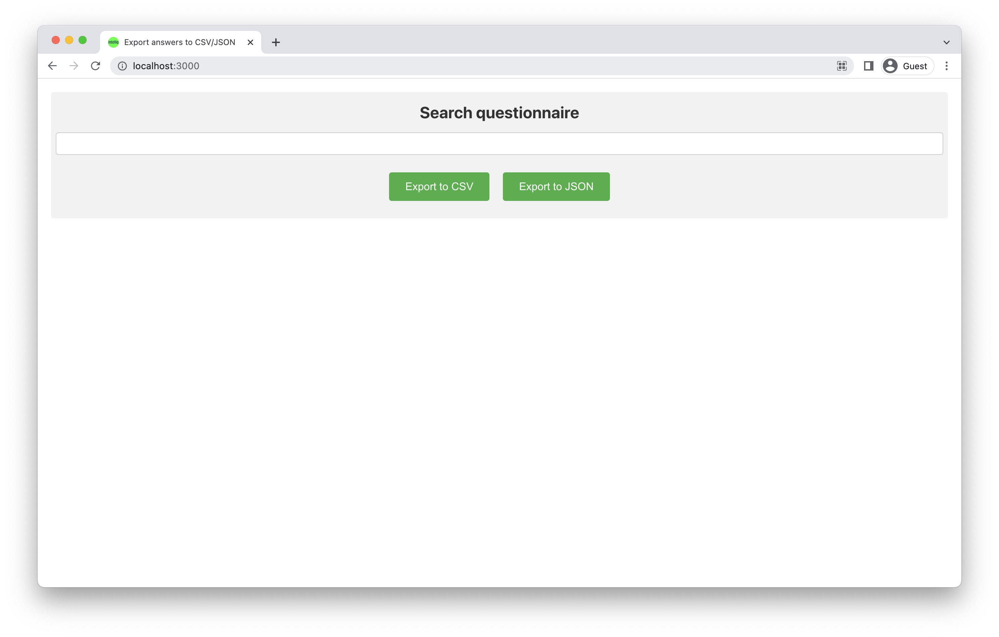

# Frontend
This folder contains everything about the frontend and the web interface.

## Dependencies

- [React](https://reactjs.org/)
- [React-dom](https://reactjs.org/docs/react-dom.html)
- [React-csv](https://www.npmjs.com/package/react-csv)
- [React-json-csv](https://www.npmjs.com/package/react-json-csv)
- [React-scripts](https://www.npmjs.com/package/react-scripts)
## Files

`index.js` Mount the App component.

`App.js` The root file that sets the routes for each page.

`Home.js` The main page of the UI, in which user selects a questionnaire.

`Home.css` Main page styling.

## Screenshots

